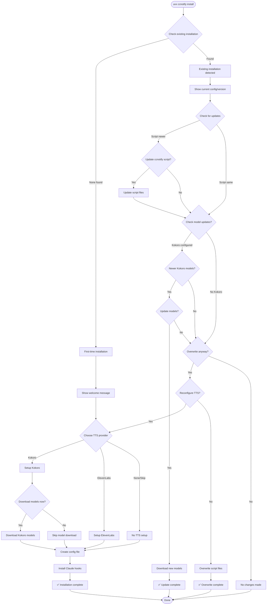

# CCNotify Installer Flow

## Single-Command Architecture: `uvx ccnotify install`

## Implementation Strategy

### Version Detection
- Check installed script version vs package version
- Check Kokoro model version if configured
- Preserve user configuration unless explicitly changing

### Update Logic
- Conservative: Only update what's necessary
- Preserve: Keep user configurations and preferences  
- Clear: Always explain what will be changed